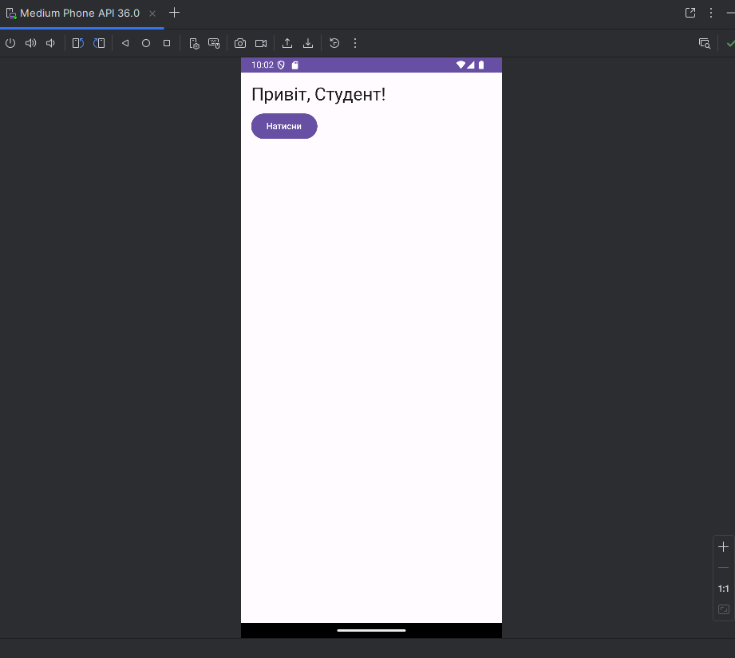

# Hello Compose

Короткий опис: Навчальний приклад використання Jetpack Compose у Android.


---

## Скриншот застосунку


---

## Як запустити

1. Встановіть Android Studio та SDK (API 26+).
2. Клонуйте репозиторій:
   ```bash
   git clone https://github.com/Astaartess/Bogdan_K_41.git
   cd Bogdan_K_41
